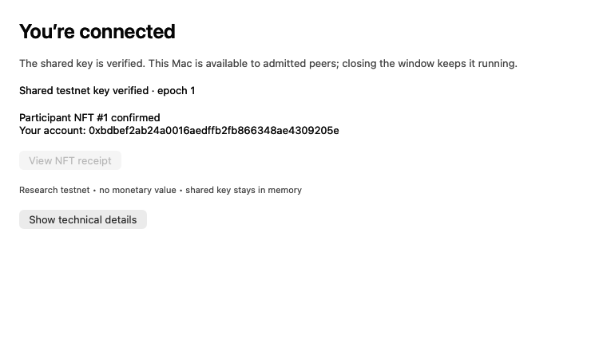

# Real Mac participant NFT validation

This is an observed agent run, not a script of a hypothetical success. The app
ran on mini-mesh with real App Attest and a development signature. Its peer and
participant were two processes on the same Mac. Transactions ran on an isolated
Anvil chain (31337), not the public Base Sepolia release. Level 2 is not yet a
live-tested user journey.



The image comes from the running app's **Save status image** rendering path. It
captures its AppKit content, excluding desktop/window chrome. The receipt-link
button is disabled because this is a local chain without a public explorer.
Diagnostics are available through **Show technical details**.

## What the user experienced

The app opened, verified its identity, found the seed, obtained the shared key,
created a personal NFT account, and claimed participant NFT #1 automatically.
No app buttons were pressed and no wallet or gas setup was required. The agent
supplied only an optional screenshot output path to the launch command.

After quitting and reopening the participant, it reacquired the shared key and
restored NFT #1 at the same account. It did not send another mint. A subsequent
app-layout update and explicit test-network key-epoch recovery also preserved
that account and NFT.

## Agent actions and observed evidence

1. Started a separate chain and relay on ports 18585/18586 and deployed using
   `scripts/release/deploy_network.py --publisher-team DC9JH5DRMY --category 3`.
   Only Anvil's publicly known disposable account paid these test transactions.
2. Built source `3acbe779a7e060f3213a429f725cad7ea73e95b9` with a local network
   overlay and the status-image/layout changes recorded in the build manifest.
   Development-signed with the existing authorized Mac keychain. No private key
   or provisioning profile is included in this evidence directory.
3. Admitted the exact signed binary in the local code registry and launched its
   seed through LaunchServices. Actual seed events reported `appAttestSupported:
   true`, `enrolled`, `executed` (bootstrap), and `seed ready`.
4. Launched the participant with:

   ```sh
   open -n --stdout build/participant.jsonl --stderr build/participant.err \
     build/nft-development-2/Node.app --args \
     --capture-status "$PWD/build/participant-claimed.png"
   ```

   Observed `key verified`, `participating`, `badge preparing`, `badge claiming`,
   then `badge claimed`. The latter reports:

   ```json
   {
     "badgeLevel": 1,
     "badgeToken": 1,
     "badgeContract": "0xa513E6E4b8f2a923D98304ec87F64353C4D5C853",
     "personalAccount": "0xbdbef2ab24a0016aedffb2fb866348ae4309205e",
     "badgeTransaction": "0x6b1f8b0a0a5d1bb161ca8c0cccf4d82e1a72f1b296038aeea04da1b040c87762",
     "chainId": 31337
   }
   ```

5. Independently read the NFT contract and transaction receipt. `ownerOf(1)`
   equals the participant account above, differs from the sponsor, and the mint
   receipt has status 1. `nextId()` remains 2 after restarting the participant,
   meaning only the one NFT was minted. The mint used 273,974 gas.
6. The first image had a transparent background that obscured the text in a dark
   viewer. Fixed the actual AppKit content view to draw its window background;
   did not retouch an image. Rebuilt/admitted the final layout, explicitly started
   key epoch 1 on the isolated chain, and restored the same participant NFT. The
   screenshot above is that real restored state, not a new mint or a mockup.

## Reproduce the checks

Use the normal Mac build/sign instructions in [README.md](README.md), the local
network overlay below, and an unused output directory. Deployments on a fresh
chain can have different addresses; regenerate the overlay from the deployment
result, then admit the exact signed output. Preserve the seed between participant
restarts. Do not apply local test network addresses to the public release.

With the isolated chain running, the ownership check is:

```sh
cast call 0xa513E6E4b8f2a923D98304ec87F64353C4D5C853 \
  'ownerOf(uint256)(address)' 1 --rpc-url http://127.0.0.1:18585
cast call 0xa513E6E4b8f2a923D98304ec87F64353C4D5C853 \
  'nextId()(uint256)' --rpc-url http://127.0.0.1:18585
```

Expected owner: `0xbdBef2aB24A0016AEdFFb2FB866348AE4309205e`; next token ID: `2`.
Fresh runs have fresh keys, so compare against their own emitted personal account,
not this fixture address. RPC correctness remains an explicit trust assumption.

Retained evidence:

- [First-run events](../data/nft-live-20261007/participant.jsonl)
- [Restart events](../data/nft-live-20261007/restart.jsonl)
- [Final screenshot-run events](../data/nft-live-20261007/participant4.jsonl)
- [Independent ownership verification](../data/nft-live-20261007/claim-verification.json)
- [Mint transaction receipt](../data/nft-live-20261007/mint-receipt.json)
- [Exact capture-build inputs](../data/nft-live-20261007/capture-build-manifest.json)
- [Local network overlay](../data/nft-live-20261007/NetworkConfig.swift)
- [Capture build activation and epoch](../data/nft-live-20261007/capture-build-activation.json)

Still required: a distributable NFT-enabled Base Sepolia build, a clean second-Mac
install, the builder handoff UI, a genuinely different signing team's Level 2 run,
and screenshots/transcript for that second level. This evidence does not close
those acceptance gates.
