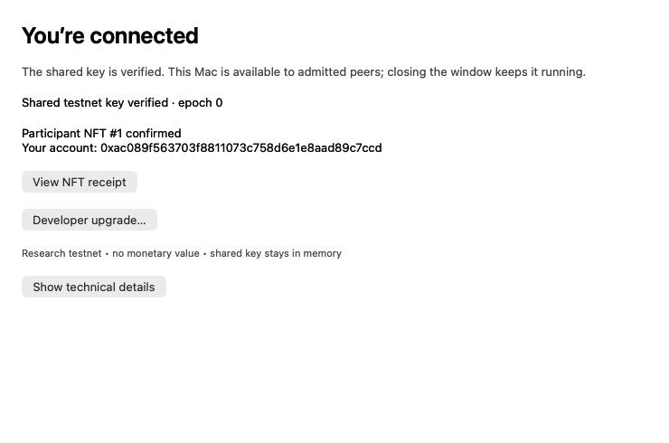

# Try AttestNode

**Mac prerelease:** Apple silicon, macOS 27, **Full Security**, and enabled
**System Integrity Protection (SIP)** are required. Reduced Security is unsupported
for this demo. Apple explains these App Attest requirements in its
[macOS security-policy overview](https://developer.apple.com/videos/play/wwdc2026/201/?time=671).
The app is available
without a GitHub account from the [unlisted handoff page](https://pod.dstack.soc1024.com/artifact-reports-2026b/attestnode-friend-handoff--D8rHDc-ANNzKZ_C7Vcy5bQ/).
Anyone holding that link can download it. The
[GitHub source and releases](https://github.com/amiller/apple-attest-p2p) are also
public, with no account required to download the app.
This candidate passed a real Mac network/claim run. A friend also reported
success, and the participant NFT receipt was independently checked. A clean
second-Mac first-open capture and the independent-developer upgrade remain
unverified.

1. Open the handoff page and choose **Download the Mac app**. The
   [GitHub release](https://github.com/amiller/apple-attest-p2p/releases/tag/v0.1.0-rc.2)
   is also available directly to anyone.
2. Extract it and open **Node.app**. Complete macOS's normal first-open confirmation
   if it appears. You do not need Xcode, a developer account, a wallet, or gas.
3. Wait for **You’re connected** and **Participant NFT confirmed**. The observed
   first run took about 48 seconds; network delays can take longer. The app retries
   connection problems and shows its current progress.
4. Choose **View NFT receipt** to inspect your testnet souvenir. Closing the window
   leaves your peer running; Quit stops it. Reopening restores your existing NFT.

The main collection now includes **Fold**, a porcelain-and-vermilion sculpture
for each of the two existing participants. Their token numbers and owners are
preserved; no second claim is needed. [View the main collection and artwork](main-collection.md).
RC2's **View NFT receipt** still opens the original attestation receipt. Artwork
for subsequent participants is not yet automatically published.

If it stays on “Verifying this app” or repeats the same Apple error, choose
**Show technical details**, then use **Save status image…** in the Testnet menu.
Send that image and, if possible, the visible error text to the person coordinating
your test. Include whether you deliberately enabled Reduced Security; an SIP
status check alone does not establish Full Security. Choose **Quit peer** to stop
repeated attempts. The error code alone does not prove a security-setting problem.

Keep the app's saved identity and Keychain entries. Do not delete them as a generic
retry step: they can hold access to an existing NFT account. RC2 does not yet
explain every permanent Apple failure in its main status text. You are not expected
to run a sequence of Terminal diagnostics to join this prerelease.

For Level 2, choose **Developer upgrade…** and follow the
[builder guide](builder-guide.md). You need your own paid Apple Developer team,
independent of the publisher, and an account-specific signed build. Keep the
original app and its Keychain intact until the handoff completes. This upgrade
is implemented but still needs its first real second-team acceptance run.

These are research testnet receipts with no monetary value. Your personal NFT
key is separate from the shared testnet key and lives in your Mac's Keychain.
There is no sponsor recovery if you lose it. App Attest does not provide a
permanent Mac-owner identity; claim limits are per app key and developer team.

For an agent or technical reviewer: the [observed transcript](agent-transcript-nft-base.md),
[PRD](PRD.md), and [release manifest](v0.1.0-rc.2.json) state exactly what was checked
and what remains unverified.
