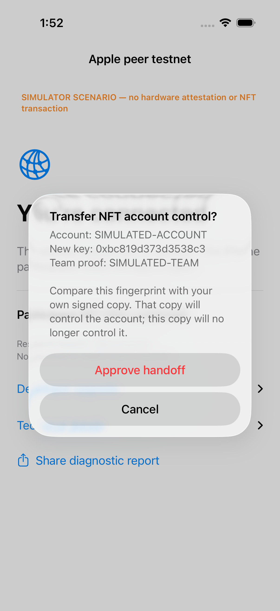
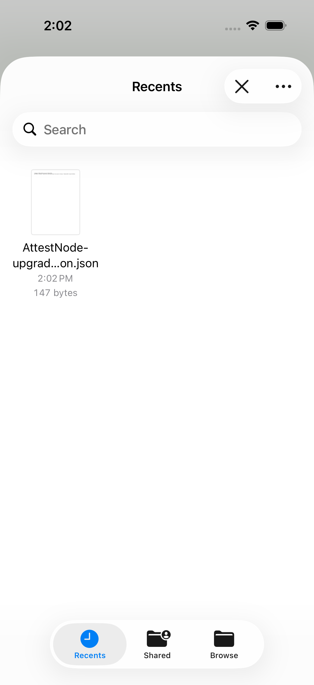
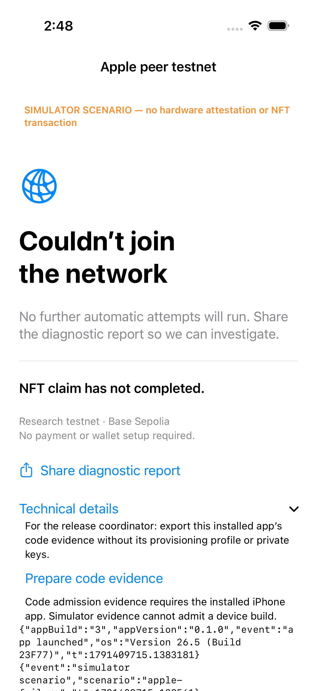

# iPhone participant validation — 7 October 2026

The iPhone app now opens directly into the participant flow. It creates and
retains a participant name, uses the pinned release network, and requests the
shared testnet key and participant NFT through the shared node implementation.
No configuration editor or Listen/Connect buttons are presented. Participation
is foreground-only. A bounded JSON-lines report can be shared or copied from the
app, including OS/app versions, the failed Apple operation and nested error codes.

**Not yet a TestFlight release.** A separate iPhone category is now deployed on
Base Sepolia but disabled, with no admitted executable. The configured iPhone
IPA was signed/exported and uploaded as version 0.1.0/build 4, including the
developer-upgrade controls and encryption declaration. Build 3 is superseded. Processing,
beta distribution, installed TestFlight measurement and iPhone activation remain
unverified; the working Mac policy is unchanged. The simulator success scenario
uses injected events: it does not attest, obtain a key, or mint an NFT.

Evidence: [`data/ios-simulator-20261007/reviewed`](../data/ios-simulator-20261007/reviewed),
with source hashes and unsigned device archive hash in
[`source-manifest.json`](../data/ios-simulator-20261007/source-manifest.json).

## Observed checks

- Xcode 27 (27A266a) on mini-mesh; dedicated iPhone 17 simulator, iOS 26.5 (23F77).
  Only this simulator runtime was installed. Tests copy sources and lower the
  copied project's deployment target; the production target remains iOS 27.
- Five XCTest UI checks: attesting, claimed, network retry, Apple failure/report
  sharing, and the actual unsupported-simulator path plus persistent participant
  identity across relaunch. The first four inject labeled events; the fifth
  exercises the real support check without network requests.
- Share → Copy was tapped by UI automation. The simulator pasteboard was read
  and parsed: the report contained `attestKey`, Apple code 0, nested
  CryptoTokenKit code -3, and its explicit simulator-scenario marker.
- Nineteen injected callback checks cover success, asynchronous completion,
  Apple errors 0–4 and retry classification, missing results, duplicate callbacks,
  timeout, late completion after timeout, overlapping operations, and bounded
  domain/code-only error-chain extraction. These exercise the callback bridge
  used by the node; they do not emulate Apple's attestation cryptography.
- The unsigned iOS 27 device archive and shared-source Mac compile check passed.
  Nineteen existing Python profile/payload tests passed.

Apple calls now log `generateKey`, `attestKey`, or `generateAssertion` separately.
An operation timeout prevents further native calls through that bridge instance,
including after a late callback. The iPhone flow stops on terminal Apple errors
instead of endlessly calling them connection failures. The enrollment context is
saved before attestation so service-unavailable retries retain the same key/hash
across restarts. Full fault-injection coverage of persisted enrollment and the
complete network/claim loop remains outstanding.

## Reproduce on the Mac

Use a dedicated booted simulator; keep other people's simulator sessions intact.
From the source checkout:

```sh
python3 scripts/release/test_ios_simulator.py \
  --device YOUR_DEDICATED_SIMULATOR_UUID --runtime 26.5 \
  --out build/iphone-simulator-run
```

The output directory must be new. It retains the exact Xcode command, XCTest
result bundle, summary, screenshots, native-test output, and the copied report.
Production build:

```sh
xcodebuild -project node/ios/AttestNode.xcodeproj -scheme AttestNode \
  -configuration Release -destination 'generic/platform=iOS' \
  -archivePath build/AttestNode-iOS27.xcarchive \
  CODE_SIGNING_ALLOWED=NO archive
```

This archive is unsigned, not installable distribution evidence. The actual
version/build number must be selected against current App Store Connect state.

## Findings preserved

The initial simulator install was rejected because the Info.plist hardcoded iOS
27 despite the simulator-only deployment override. The manifest now uses the
project deployment setting. The first sharing assertion incorrectly queried
Copy as a button; inspection established it was a share-sheet cell, and the
corrected test tapped it and verified the clipboard. Screenshot review found
that the simulator label could scroll away; it is now pinned above the content.

## Remaining acceptance

Sign/export/upload using the existing authorized App Store Connect account;
check the installed Apple-distributed executable and attestation profile; admit
it under a compatible network policy; exercise a physical iOS 27 device through
join, receipt verification, NFT mint, restart, and report sharing. Complete beta
review/external group setup and verify the resulting friend-accessible link.
The iPhone developer-upgrade file UI is not yet implemented. Do not claim the
full Level 2 iPhone journey from the shared underlying code alone.

## Signed export follow-through

The iOS 27 archive was signed with the existing Xcode account and exported using
`method=app-store-connect`, `destination=export`, automatic signing, and team
`DC9JH5DRMY`. This saved a local IPA; it did not upload or submit beta review.
The initial signing attempt failed with `errSecInternalComponent`. Unlocking the
existing dedicated signing keychain using its already-authorized local mechanism
resolved it. No credential was printed or copied into source control.

[`iphone-app-store-export.json`](iphone-app-store-export.json) records version
0.1.0/build 3, the IPA/executable hashes, strict signature verification, production
App Attest and CDhash opt-in, `get-task-allow=false`, and zero provisioned device
identifiers in the distribution profile. The executable does not contain the
simulator fixture environment-variable selector. Build 3 is an export value,
not proof it is available for upload; check current App Store Connect state.

Eight existing contract tests using retained real iPhone evidence also passed:
correct iOS enrollment/assertions and network admission, modified/tampered or
unregistered code rejection, and rejection under the Mac key profile. The
fixture was captured from an ad-hoc iPhone build (validation category 5), **not**
this new build or a TestFlight-installed iOS 27 app. Results are retained in
[`iphone-cryptographic-tests.txt`](../data/ios-simulator-20261007/iphone-cryptographic-tests.txt).

Reproduction after a signed archive exists:

```sh
xcodebuild -project node/ios/AttestNode.xcodeproj -scheme AttestNode \
  -configuration Release -destination 'generic/platform=iOS' \
  -archivePath build/AttestNode-iOS27-signed.xcarchive \
  DEVELOPMENT_TEAM=YOUR_TEAM_ID -allowProvisioningUpdates archive
```

Export options used (local export only):

```xml
<plist version="1.0"><dict>
<key>method</key><string>app-store-connect</string>
<key>destination</key><string>export</string>
<key>teamID</key><string>YOUR_TEAM_ID</string>
<key>signingStyle</key><string>automatic</string>
<key>manageAppVersionAndBuildNumber</key><false/>
<key>uploadSymbols</key><true/>
</dict></plist>
```

```sh
xcodebuild -exportArchive \
  -archivePath build/AttestNode-iOS27-signed.xcarchive \
  -exportOptionsPlist build/TestFlightExportOptions.plist \
  -exportPath build/app-store-export -allowProvisioningUpdates
```

The live deployment must not be repinned to the iPhone executable. Its
`CDRegistry` admits one baseline, its adapter fixes the Mac ACL and signing
category, and its `ResearchBadges` fixes that adapter/category. The network
contract supports additional categories; an additive iOS route can share its
zero-scope peer network, but the relay, badge policy and account-upgrade policy
must explicitly support that route. In particular, a second team's differently
signed build and an Apple-processed TestFlight build cannot be assumed to share
a validation category. Preserve existing Mac membership/NFTs and test these
bindings before enabling iPhone admission.


## Additive relay routing

The optional `/ios` route is implemented in source and tested with a loopback
RPC stub. Five relay tests pass: cross-platform NFT mailbox exchange with
separate enrollment categories and preserved legacy isolation/journal, absent
iOS configuration, wrong registry, wrong sponsor, and reused Mac category.
These are transport/configuration checks, not fresh iPhone attestations. The initial check was source-only. The later live deployment below publishes
`network-ios.json` while leaving iPhone admission disabled.

Apple's official [validation documentation](https://developer.apple.com/documentation/devicecheck/validating-apps-that-connect-to-your-server)
was checked on 7 October: TestFlight uses validation category **2**, distinct
from the retained ad-hoc fixture's **5** and the Mac release's Developer ID
category **6**. Production iPhone admission must check the TestFlight profile
explicitly; a passing ad-hoc fixture does not establish the installed beta's
category, executable hash, or permitted independent-team signing path.

## Inactive iPhone category preparation

`scripts/release/prepare_ios_category.py` adds a separate TestFlight (category 2,
iOS key ACL, production AAGUID) adapter and empty code registry to the existing
V2 network. It creates the matching badge/account contracts but **does not set a
code baseline or enable admission**. Its transaction journal is written before
submission; an existing output or journal prevents a blind repeat deployment.
It checks the network administrator and publisher, and compares the original Mac
category, code baseline and global pause state before/after preparation.

An isolated Anvil run on chain 31337 passed. The original Mac category stayed
active and its recorded Developer ID build remained admitted; the new iPhone
category stayed disabled, rejected execution, and had an empty code baseline.
The badge contract pointed to the intended iPhone adapter/network. Repeating the
same command was refused without changing the administrator's nonce. The
manifests, transaction journal and check results are retained in
[`ios-category-local-20261007`](../data/ios-category-local-20261007).

Commands used, with the standard public Anvil fixture key supplied in
`PRIVATE_KEY` (never use that key on a real deployment):

```sh
anvil --host 127.0.0.1 --port 19473 --silent
python3 scripts/release/deploy_network.py \
  --rpc http://127.0.0.1:19473 \
  --build contracts/fixtures/cd-args-developer-id.json \
  --out build/ios-category-test/mac.json \
  --publisher-team DC9JH5DRMY --activate
python3 scripts/release/prepare_ios_category.py \
  --rpc http://127.0.0.1:19473 \
  --existing build/ios-category-test/mac.json \
  --out build/ios-category-test/ios.json
```

No Base Sepolia contracts or deployed service changed in this test. Before live
use, serialize administrator transactions with the running relay's sponsor
queue; reading the pending nonce alone does not prevent concurrent sends.
The addresses then belong in a dedicated iPhone configuration, followed by a
new build/export and installed TestFlight measurement before activation.
The current single-category badge/account contracts do not establish a
cross-platform upgrade or permit a category-5 ad-hoc builder to substitute for
a category-2 TestFlight build. That path still needs explicit implementation and
acceptance evidence; the Mac builder journey remains independently pending.


## Live preparation and configured IPA

The tested preparation was executed on Base Sepolia. Addresses and five confirmed
transactions are in
[`prepare-ios-base-sepolia.json`](../contracts/network/prepare-ios-base-sepolia.json);
the adjacent progress journal preserves the original Mac-policy snapshot. The
iPhone category remains disabled and its code registry has no approved baseline.

During deployment the relay's sponsor writes were temporarily paused through its
environment flag, with its transaction journal confirmed idle and the sponsor's
latest/pending nonces equal. After preparation the relay was redeployed with
writes restored and the additive iPhone configuration. A startup probe briefly
returned HTTP 500. A later check confirmed all routes healthy, maintenance off,
and completed sponsored transactions advancing from 29 to 31. A resumed relay
can legitimately show in-flight transactions; this is not an idle-maintenance
condition. See [`ios-relay-live.json`](ios-relay-live.json).

`node/ios/NetworkConfig.swift` now pins the iPhone category, badge/account contracts
and `/ios` endpoint. The Mac network file is unchanged. The iPhone project and
simulator build include this dedicated file. The five UI tests and nineteen
callback checks passed again with this configuration; summaries and the copied
report are in
[`ios-configured-simulator-20261007`](../data/ios-configured-simulator-20261007).
The signed configured IPA export succeeded and passed strict signature checks;
its hashes and source configuration digest are recorded in
[`iphone-configured-export.json`](iphone-configured-export.json). The earlier
unconfigured IPA is superseded. The configured archive was subsequently uploaded successfully as recorded below.

The public category is **not activated** merely because its addresses and relay
route exist. Installed TestFlight measurement/admission, beta distribution and
the second-team signing/upgrade journey remain open acceptance work.


## App Store Connect upload

The configured archive was exported with `destination=upload`, automatic signing
and `manageAppVersionAndBuildNumber=true`. Xcode returned exit 0 and reported
“Upload succeeded.” Structured metadata in `ContentDelivery.log` confirms version
0.1.0/build 3. A subsequent user-provided App Store Connect screenshot shows
version 0.1.0, build 3, with status **Missing Compliance**. The existing build
needs its encryption declaration completed through Manage before distribution
can proceed; no friend-accessible installation has been verified.
The upload process itself completed and should not be restarted merely because
the beta distribution state is not yet queried.

Sanitized evidence is in [`iphone-testflight-upload.json`](iphone-testflight-upload.json).
No authentication logs or credentials are committed. iPhone admission remains
disabled. The planned beta text and acceptance sequence are in
[`testflight-review.md`](testflight-review.md).

The source now declares `ITSAppUsesNonExemptEncryption=false` for future builds,
reflecting encryption supplied by Apple system frameworks. This does not change
the already-uploaded build 3. After the pending developer-upgrade UI changes,
the five simulator UI tests and nineteen injected native callback checks passed
again in `mini-mesh:~/agent-drop/iphone-friend-flow/build/ios-upgrade-ui-validation`.
Those tests cover the existing participant and diagnostic flows; they do not
prove the new file handoff UI or a second-team hardware upgrade.


## Developer upgrade UI checks

The revised run `build/ios-upgrade-consent-validation-v2` passed **8 UI tests**
and **19 injected native callback checks**. All tested Swift source hashes match
the local checkout. Evidence, screenshots, command, and copied diagnostic report
are in [`ios-upgrade-simulator-20261007`](../data/ios-upgrade-simulator-20261007).

The new tests open/cancel the real system file picker, reject malformed and
oversized files, exercise explicit consent/cancellation, and confirm a simulator
scenario cannot invoke a real signer. The original seven-test run failed because
the confirmation popover hid its Cancel button; visual inspection confirmed that
failure. The replacement alert displays both Cancel and Approve handoff. Its
action uses the presented request snapshot, while `Node.approveUpgrade` rechecks
eligibility before signing. The passing consent screenshot was visually reviewed.



These checks do **not** validate successful invitation/request file export, the
positive cryptographic handoff, second-team signing, installed TestFlight code,
or physical-device admission. Uploaded build 3 predates these controls. The
next device archive must be a new build and must exclude simulator selectors.


## Build 4 device archive and export

Source revision `70d43ab` was archived on mini-mesh with the production iOS 27
target and `CURRENT_PROJECT_VERSION=4`. The archive and local App Store export
both returned exit 0. `codesign --verify --deep --strict` passed; the export has
production App Attest plus CDhash opt-in, an explicit exempt-encryption flag,
and none of the simulator scenario selectors. Public hashes are recorded in
[`iphone-upgrade-export.json`](iphone-upgrade-export.json).

Commands from `~/agent-drop/iphone-friend-flow` after the authorized dedicated
signing keychain was unlocked (no credential value is recorded):

```sh
xcodebuild -quiet -project node/ios/AttestNode.xcodeproj -scheme AttestNode \
  -configuration Release -destination 'generic/platform=iOS' \
  -archivePath build/AttestNode-iOS27-upgrade.xcarchive \
  DEVELOPMENT_TEAM=DC9JH5DRMY CURRENT_PROJECT_VERSION=4 \
  -allowProvisioningUpdates archive
xcodebuild -quiet -exportArchive \
  -archivePath build/AttestNode-iOS27-upgrade.xcarchive \
  -exportOptionsPlist build/TestFlightExportOptions.plist \
  -exportPath build/app-store-upgrade-export -allowProvisioningUpdates
```

The export options use `method=app-store-connect`, `destination=export`,
`signingStyle=automatic`, team `DC9JH5DRMY`, upload symbols enabled, and automatic
version/build management disabled. The next upload uses the same options with
`destination=upload`, preserving build 4. The local exported CodeDirectory is
not a verified installed TestFlight measurement and has not been admitted.


Build 4 upload completed with exit 0 at Mac log time 2026-10-07 13:57:17.515.
Xcode reported “Upload succeeded”; structured ContentDelivery metadata confirms
version 0.1.0/build 4. See
[`iphone-testflight-build4-upload.json`](iphone-testflight-build4-upload.json).
The last observed server state was package processing. This is not a verified
beta installation or proof that App Store Connect has cleared compliance.
Neither network admission nor the Mac baseline was changed.


## Real Files invitation round trip

The follow-up `ios-file-roundtrip-validation` run passed **9 UI tests** and
**19 injected callback checks**. It uses a clearly marked, non-signing simulated
invitation but the actual app document exporter and the system Files picker.
The test saves the invitation, replaces the previous test file, reads back the
exact JSON bytes, selects that file in the importer, and reaches the node-operation
guard after decoding it. There is no live node in the fixture, so it cannot
prepare a cryptographic upgrade request or sign a handoff. This is evidence for
the invitation document workflow, not for those remaining protocol steps.

The initial export-only run also passed. The final run and source hashes are
retained in [`ios-files-simulator-20261007`](../data/ios-files-simulator-20261007),
with three screenshots from the Files test. The readback and reimport captures
were visually inspected. To reproduce on the dedicated booted simulator, using
a new output directory:

```sh
python3 scripts/release/test_ios_simulator.py \
  --device 94AF2D7C-C88D-4CF1-A087-D73F9765DA81 --runtime 26.5 \
  --out build/ios-file-roundtrip-validation
```



The additional fixture and shared invitation-presentation helper postdate build
4. A device-target Release compile also passed; its binary excludes the simulator
selector and export-fixture strings. This is an unsigned compile check, not a
new TestFlight upload. Build 4 remains the uploaded candidate. Positive request
creation/export/tracking and second-team device handoff remain acceptance work.


## Scoped iPhone code admission

`scripts/release/admit_ios_release.py` now inspects or sets the disabled iPhone
category's baseline independently of the active Mac category. Inspection is the
default and requires no private key. The tool checks chain/network identity,
distinct registries/categories, ownership, adapter bindings, production AAGUID,
iOS ACL, TestFlight validation category 2, the supplied CD hash, and the on-chain
code/entitlement measurement. With `--execute`, it journals the two signed
transaction hashes before broadcasting setBuild/registerBuild. It refuses an
existing journal, an enabled iPhone category, or a pending administrator nonce.
It checks preservation of the Mac baseline/category/global pause state and the
iPhone category policy. It never enables admission.

Five integration tests passed on a disposable loopback Anvil chain: keyless
read-only operation, invalid-input rejection without transactions, actual
baseline/registration while preserving an active Mac policy, enabled-category
rejection, and pending-administrator-transaction rejection. The test uses an
existing historical iPhone CodeDirectory fixture to exercise registry mechanics;
it does not demonstrate a real TestFlight attestation. An initial expanded-suite
setup ran out of the local public development account's test balance. The fixture
now replenishes that account through Anvil before deployment; all five tests then
passed. No Base Sepolia contracts were modified.

```sh
anvil --host 127.0.0.1 --port 19475 --silent
ATTEST_ADMISSION_TEST_RPC=http://127.0.0.1:19475 \
  python3 -m unittest discover -s tests -p test_ios_admission.py -v
```

For the live operator, first obtain and review the **installed TestFlight**
executable/profile evidence and extract its `cd_args.py` JSON. Provenance is not
verified by this command; the report explicitly says so. Do not substitute the
local IPA export and claim it is installed-build evidence. Then inspect:

```sh
python3 scripts/release/admit_ios_release.py \
  --rpc https://sepolia.base.org \
  --ios contracts/network/prepare-ios-base-sepolia.json \
  --mac contracts/network/deploy-nft-base-sepolia.json \
  --build /path/to/reviewed-installed-code.json \
  --out build/ios-admission-plan.json
```

After reviewing the result, coordinate **all** administrator-key users, pause
relay sponsor writes, confirm the journal is idle, and run with `--execute` and
a fresh output path using the existing secure key mechanism. A nonce check is
not a distributed lock. Restore sponsor writes when the two transactions are
reconciled. The iPhone category remains disabled for the subsequent explicit
activation/physical-device acceptance steps. The Mac-only admission command
must not be used for this process.


## Installed-code export preparation (after build 4)

The iPhone UI now offers Technical details → Prepare code evidence → Share code
evidence. It reads the installed executable and exports only CodeDirectory,
first code page, DER entitlements and load-command offsets in `cd_args.py` format,
with app/build metadata. It does not include a provisioning profile, CMS
signature, enrollment state or private keys. This local measurement is not Apple
attestation or proof of provenance; review and live attestation remain required.
Build 4 does not contain this feature.

The bounded Swift parser passed 16 checks against the signed build-4 App Store
export and malformed variants. Its six fields exactly matched Python
`cd_args.py`. A device-target Release compile passed. The final simulator run
passed all 10 UI tests and 19 injected callback checks, including simulator
export refusal, visible error diagnostics, and copying the ordinary failure
report. The simulator uses iOS 26.5 with the isolated test target lowered; the
production app still requires iOS 27. Physical-device export and TestFlight
re-signing behavior have not been verified.

An intermediate UI test failed to open the diagnostic share sheet after
collapsing details. Moving Share diagnostic report above the expandable section
keeps its position stable; the full rerun passed. Evidence and source hashes are
in [the validation record](../data/ios-code-evidence-20261007/validation.json).



Run the parser checks on macOS against a signed device executable:

```sh
xcrun swiftc node/ios/CodeEvidence.swift node/tests/CodeEvidenceTests.swift -o build/code-evidence-tests
build/code-evidence-tests /path/to/AttestNode.app/AttestNode build/code-evidence.json
```

Build 5 now packages these changes from public source `42a0beb`. Its signed
App Store export passed strict signature, production App Attest, iOS 27 minimum,
non-exempt encryption declaration and simulator-fixture exclusion checks. The
parser passed all 16 checks against this new export, and all six fields matched
Python exactly. Upload succeeded; Apple reported processing. These are export
and upload checks, not an installed TestFlight or physical-device success. See
[build 5 export](iphone-build5-export.json) and
[upload receipt](iphone-testflight-build5-upload.json).

The deployed iPhone CDRegistry accepted the local build-5 measurement through
`eth_call` at Base Sepolia block 47821039. The
[readiness snapshot](../data/ios-code-evidence-20261007/live-readiness.json) records
the returned measurement, empty iPhone baseline, disabled iPhone category and
enabled Mac policy. No transactions were sent. This catches format/policy
integration issues before a friend's device run, but does not substitute for
Apple's installed TestFlight signature and actual App Attest evidence.
